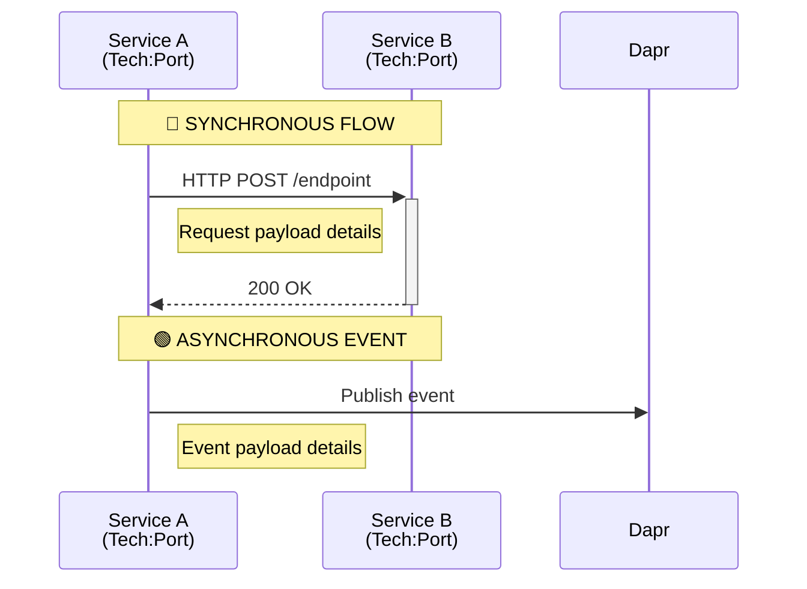

# Workflow Documentation

> **Purpose**: Visual sequence diagrams showing how services interact for key use cases  
> **Format**: Mermaid sequence diagrams with detailed event payloads  
> **Last Updated**: February 17, 2026

## Available Workflows

### ✅ Completed

| Workflow                                             | Description                                               | Services Involved                                                                     | Status      |
| ---------------------------------------------------- | --------------------------------------------------------- | ------------------------------------------------------------------------------------- | ----------- |
| [User Registration](./USER_REGISTRATION_WORKFLOW.md) | Complete user registration flow from UI to email delivery | Customer UI, Web BFF, Auth Service, User Service, Notification Service, Audit Service | ✅ Complete |

### 🚧 Planned

| Workflow                       | Description                                       | Services Involved                                                                     | Priority  |
| ------------------------------ | ------------------------------------------------- | ------------------------------------------------------------------------------------- | --------- |
| **User Login**                 | Authentication flow with JWT token issuance       | Customer UI, Web BFF, Auth Service, User Service                                      | 🔥 High   |
| **Email Verification**         | User clicks verification link to activate account | Customer UI, Auth Service, User Service, Notification Service                         | 🔥 High   |
| **Password Reset**             | Forgot password flow with reset token             | Customer UI, Web BFF, Auth Service, User Service, Notification Service                | 🔥 High   |
| **Product Search**             | Product discovery with filtering and pagination   | Customer UI, Web BFF, Product Service                                                 | 🟡 Medium |
| **Add to Cart**                | Adding product to shopping cart                   | Customer UI, Web BFF, Cart Service, Product Service, Inventory Service                | 🟡 Medium |
| **Checkout Process**           | Complete order placement flow                     | Customer UI, Web BFF, Order Service, Cart Service, Payment Service, Inventory Service | 🔥 High   |
| **Order Processing**           | Background order processing and fulfillment       | Order Service, Order Processor Service, Inventory Service, Notification Service       | 🟡 Medium |
| **Payment Processing**         | Payment capture and validation                    | Order Service, Payment Service, Notification Service                                  | 🔥 High   |
| **Inventory Update**           | Stock level updates and synchronization           | Inventory Service, Product Service, Order Service                                     | 🟢 Low    |
| **Review Submission**          | Customer submits product review                   | Customer UI, Web BFF, Review Service, Product Service, User Service                   | 🟢 Low    |
| **Admin: Bulk Product Import** | Admin uploads product catalog via CSV/Excel       | Admin UI, Product Service                                                             | 🟢 Low    |
| **Admin: User Management**     | Admin searches, views, and manages users          | Admin UI, Admin Service, User Service                                                 | 🟢 Low    |

---

## How to Read the Diagrams

### Communication Patterns

- **🔵 Synchronous**: HTTP REST API calls (request-response pattern)
  - Caller waits for response
  - Used for data retrieval or operations requiring immediate confirmation
  - Example: `Auth Service → User Service (POST /api/users)`

- **🟢 Asynchronous**: Event-driven via Dapr Pub/Sub (fire-and-forget)
  - Publisher doesn't wait for consumers
  - Used for notifications, audit logging, eventual consistency
  - Example: `User Service → Dapr → user.created event`

### Numbering Convention

Sequence diagrams are numbered sequentially (1, 2, 3...) to show the order of operations. Note that asynchronous events (🟢) may process in parallel.

### Event Payload Format

All events follow the CloudEvents 1.0 specification:

```json
{
  "specversion": "1.0",
  "type": "com.xshopai.{service}.{action}",
  "source": "{service-name}",
  "id": "{unique-event-id}",
  "time": "{ISO-8601-timestamp}",
  "datacontenttype": "application/json",
  "data": {
    /* event-specific payload */
  },
  "metadata": { "traceId": "...", "spanId": "..." }
}
```

See [CloudEvents Standard](../CLOUDEVENTS_STANDARD.md) for full specification.

---

## Creating New Workflows

### Template Structure

Each workflow document should contain:

1. **Overview**: Brief description of the use case
2. **Architecture Components**: Table of services, technologies, ports, and roles
3. **Communication Patterns**: Legend explaining sync/async calls
4. **Sequence Diagram**: Mermaid diagram with detailed interactions
5. **Event Payload Details**: JSON examples for all events
6. **Step-by-Step Flow**: Narrative description of each phase
7. **Error Handling**: Common errors and responses
8. **Distributed Tracing**: Trace propagation example
9. **Performance Characteristics**: Expected latencies
10. **Security Considerations**: Authentication, authorization, encryption
11. **Related Workflows**: Links to connected use cases

### Mermaid Tips



**Key Elements**:

- Use `participant` with `<br/>` for multi-line labels
- Use `Note over` for section headers
- Use `Note right of` or `Note left of` for payload details
- Use `+` and `-` for activation boxes (lifelines)
- Use `-->>` for responses (dashed arrows)

---

## Requesting New Workflows

To request a new workflow diagram:

1. Open an issue in the repository
2. Use template: `[WORKFLOW] {Name}`
3. Describe:
   - User story (As a... I want to... So that...)
   - Services involved
   - Expected outcomes
   - Special requirements (security, performance, etc.)

---

## Contributing

See [CONTRIBUTING.md](../CONTRIBUTING.md) for guidelines on:

- Code style for Mermaid diagrams
- Documentation standards
- Review process
- Branch naming conventions

---

## Additional Resources

- [Platform Architecture](../PLATFORM_ARCHITECTURE.md)
- [Service Catalog](../PLATFORM_ARCHITECTURE.md#service-catalog)
- [CloudEvents Standard](../CLOUDEVENTS_STANDARD.md)
- [Messaging Architecture](../MESSAGING_ARCHITECTURE.md)
- [Port Configuration](../PORT_CONFIGURATION.md)
