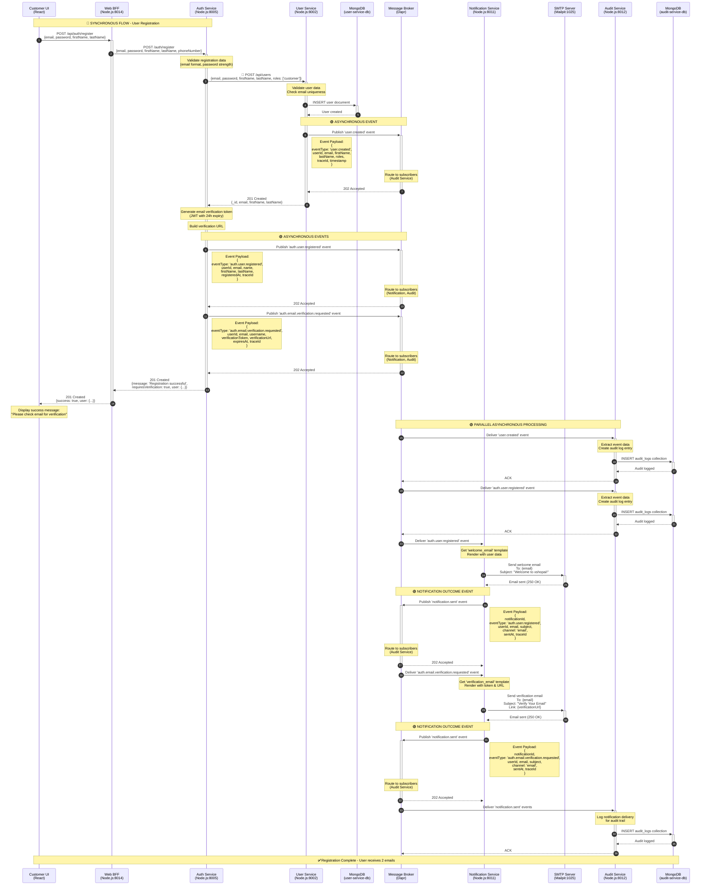

# User Registration Workflow

## Overview

This document describes the complete user registration workflow in the xshopai platform, showing how services interact through both synchronous HTTP calls and asynchronous event-driven messaging via the Message Broker.

## Architecture Components

| Component                | Technology           | Port        | Type           | Role                                  |
| ------------------------ | -------------------- | ----------- | -------------- | ------------------------------------- |
| **Customer UI**          | React SPA            | 3000        | Client         | User interface for registration       |
| **Web BFF**              | Node.js + Express    | 8014        | Microservice   | Backend for Frontend - API gateway    |
| **Auth Service**         | Node.js + Express    | 8005        | Microservice   | Authentication & authorization        |
| **User Service**         | Node.js + Express    | 8002        | Microservice   | User profile management               |
| **Notification Service** | Node.js + Express    | 8011        | Microservice   | Email/notification delivery           |
| **Audit Service**        | Node.js + TypeScript | 8012        | Microservice   | Event logging & audit trail           |
| **Message Broker**       | Dapr Runtime         | 3500 (HTTP) | Infrastructure | Event bus abstraction (uses RabbitMQ) |
| **MongoDB**              | Database             | 27017/27018 | Infrastructure | User data persistence                 |
| **SMTP Server**          | Mailpit              | 1025        | Infrastructure | Email delivery (dev environment)      |

> **Note**: The Message Broker (Dapr Pub/Sub) provides a vendor-agnostic messaging abstraction. The backend (RabbitMQ, Azure Service Bus, Kafka, etc.) is configurable via Dapr components without code changes.

## Communication Patterns

- **🔵 Synchronous**: HTTP REST API calls (request-response)
- **🟢 Asynchronous**: Event-driven via Message Broker (fire-and-forget)

---

## Sequence Diagram



---

## Event Payload Details

### 1. `user.created` Event

**Publisher**: User Service  
**Subscribers**: Audit Service  
**Topic**: `user.created`

```json
{
  "specversion": "1.0",
  "type": "com.xshopai.user.created",
  "source": "user-service",
  "id": "550e8400-e29b-41d4-a716-446655440000",
  "time": "2026-02-17T10:30:00Z",
  "datacontenttype": "application/json",
  "data": {
    "userId": "65f8a1b2c3d4e5f6g7h8i9j0",
    "email": "john.doe@example.com",
    "firstName": "John",
    "lastName": "Doe",
    "roles": ["customer"],
    "isEmailVerified": false,
    "isActive": true,
    "createdAt": "2026-02-17T10:30:00Z"
  },
  "metadata": {
    "traceId": "trace-abc-123-xyz",
    "ipAddress": "192.168.1.100",
    "userAgent": "Mozilla/5.0...",
    "environment": "production"
  }
}
```

### 2. `auth.user.registered` Event

**Publisher**: Auth Service  
**Subscribers**: Notification Service, Audit Service  
**Topic**: `auth.user.registered`

```json
{
  "specversion": "1.0",
  "type": "com.xshopai.auth.user.registered",
  "source": "auth-service",
  "id": "660e8400-e29b-41d4-a716-446655440001",
  "time": "2026-02-17T10:30:01Z",
  "datacontenttype": "application/json",
  "data": {
    "userId": "65f8a1b2c3d4e5f6g7h8i9j0",
    "email": "john.doe@example.com",
    "name": "John Doe",
    "firstName": "John",
    "lastName": "Doe",
    "registeredAt": "2026-02-17T10:30:00Z"
  },
  "metadata": {
    "traceId": "trace-abc-123-xyz",
    "timestamp": "2026-02-17T10:30:01Z"
  }
}
```

### 3. `auth.email.verification.requested` Event

**Publisher**: Auth Service  
**Subscribers**: Notification Service, Audit Service  
**Topic**: `auth.email.verification.requested`

```json
{
  "specversion": "1.0",
  "type": "com.xshopai.auth.email.verification.requested",
  "source": "auth-service",
  "id": "770e8400-e29b-41d4-a716-446655440002",
  "time": "2026-02-17T10:30:01Z",
  "datacontenttype": "application/json",
  "data": {
    "userId": "65f8a1b2c3d4e5f6g7h8i9j0",
    "email": "john.doe@example.com",
    "username": "John Doe",
    "firstName": "John",
    "lastName": "Doe",
    "verificationToken": "eyJhbGciOiJIUzI1NiIsInR5cCI6IkpXVCJ9...",
    "verificationUrl": "http://localhost:3000/verify-email?token=eyJhbGci...",
    "expiresAt": "2026-02-18T10:30:01Z"
  },
  "metadata": {
    "traceId": "trace-abc-123-xyz",
    "timestamp": "2026-02-17T10:30:01Z"
  }
}
```

### 4. `notification.sent` Event

**Publisher**: Notification Service  
**Subscribers**: Audit Service  
**Topic**: `notification.sent`

```json
{
  "specversion": "1.0",
  "type": "com.xshopai.notification.sent",
  "source": "notification-service",
  "id": "880e8400-e29b-41d4-a716-446655440003",
  "time": "2026-02-17T10:30:05Z",
  "datacontenttype": "application/json",
  "data": {
    "notificationId": "notif-abc-123",
    "originalEventType": "auth.user.registered",
    "userId": "65f8a1b2c3d4e5f6g7h8i9j0",
    "recipientEmail": "john.doe@example.com",
    "subject": "Welcome to xshopai!",
    "channel": "email",
    "sentAt": "2026-02-17T10:30:05Z",
    "status": "delivered"
  },
  "metadata": {
    "traceId": "trace-abc-123-xyz",
    "spanId": "span-xyz-789"
  }
}
```

---

## Step-by-Step Flow Description

### Phase 1: Client Request (Steps 1-2)

1. User fills registration form in Customer UI (React)
2. UI submits POST to Web BFF `/api/auth/register`
3. BFF forwards to Auth Service `/auth/register`

**Communication**: 🔵 Synchronous HTTP

### Phase 2: User Creation (Steps 3-7)

4. Auth Service validates input (email format, password strength)
5. Auth Service calls User Service 🔵 **synchronously** to create user
6. User Service validates uniqueness and inserts into MongoDB
7. User Service publishes 🟢 `user.created` event via Message Broker
8. User Service returns success to Auth Service

**Communication**: Mixed (HTTP sync + Event async)

### Phase 3: Event Publishing (Steps 8-13)

9. Auth Service generates email verification JWT token (24h expiry)
10. Auth Service builds verification URL
11. Auth Service publishes 🟢 `auth.user.registered` event (async)
12. Auth Service publishes 🟢 `auth.email.verification.requested` event (async)
13. Auth Service returns success response to client
14. UI displays success message

**Communication**: 🟢 Asynchronous events (fire-and-forget)

### Phase 4: Parallel Event Processing (Steps 14-28)

**Audit Service** (steps 15-20):

- Subscribes to `user.created` → logs to audit DB
- Subscribes to `auth.user.registered` → logs to audit DB
- Subscribes to `notification.sent` → logs to audit DB

**Notification Service** (steps 21-28):

- Subscribes to `auth.user.registered`:
  - Loads "welcome_email" template
  - Renders with user data
  - Sends via SMTP (Mailpit in dev)
  - Publishes `notification.sent` event
- Subscribes to `auth.email.verification.requested`:
  - Loads "verification_email" template
  - Renders with token/URL
  - Sends via SMTP
  - Publishes `notification.sent` event

**Communication**: 🟢 All asynchronous via Message Broker

---

## Error Handling

### Synchronous Errors

| Error                | Status | Response                                               |
| -------------------- | ------ | ------------------------------------------------------ |
| Invalid email format | 400    | `{error: "Invalid email format"}`                      |
| Weak password        | 400    | `{error: "Password must be at least 8 characters..."}` |
| Duplicate email      | 409    | `{error: "A user with this email already exists"}`     |
| User Service down    | 503    | `{error: "User service is temporarily unavailable"}`   |

### Asynchronous Errors

- **Event Publishing Failure**: Auth Service logs warning but returns success (graceful degradation)
- **Email Delivery Failure**: Notification Service publishes `notification.failed` event with error details
- **Event Processing Failure**: Consumer (Audit/Notification) logs error and NACKs message for retry

---

## Distributed Tracing

All services propagate `traceId` and `spanId` through:

- HTTP headers: `x-trace-id`, `traceparent`
- CloudEvents metadata: `traceId`, `spanId`
- Structured logs: `{traceId, spanId, operation, ...}`

**Example Trace**:

```
traceId: trace-abc-123-xyz
  ├─ span-1: Customer UI → Web BFF
  ├─ span-2: Web BFF → Auth Service
  ├─ span-3: Auth Service → User Service
  ├─ span-4: User Service → MongoDB
  ├─ span-5: User Service → Message Broker (user.created)
  ├─ span-6: Auth Service → Message Broker (auth.user.registered)
  ├─ span-7: Auth Service → Message Broker (auth.email.verification.requested)
  ├─ span-8: Notification Service → SMTP (welcome email)
  └─ span-9: Notification Service → SMTP (verification email)
```

---

## Related Workflows

- [User Login Workflow](./USER_LOGIN_WORKFLOW.md) _(to be created)_
- [Email Verification Workflow](./EMAIL_VERIFICATION_WORKFLOW.md) _(to be created)_
- [Password Reset Workflow](./PASSWORD_RESET_WORKFLOW.md) _(to be created)_
